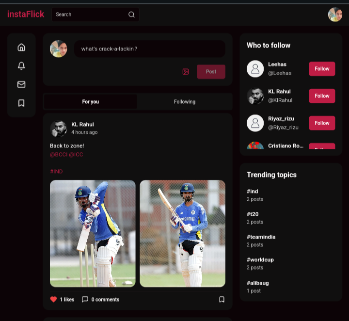

<h1 align="center">Hi 👋! I'm Salman Shareef, a Full Stack Developer and Machine Learning Enthusiast</h1>

###

  
  

###

  

###

  

###

  
  

###

<h3 align="center">Connect with me:</h3>

  
  
  
  
  
  

###

<h3 align="center">Languages:</h3>

  
  
  
  
  

###

<h3 align="center">Frameworks and Libraries:</h3>

  
  
  
  

###

<h3 align="center">Tools:</h3>

  
  
  
  
  

###

<h3 align="center">Featured Projects:</h3>

  

###

  I am passionate about developing full stack applications and diving deep into machine learning algorithms. Let's connect and explore new opportunities together!

